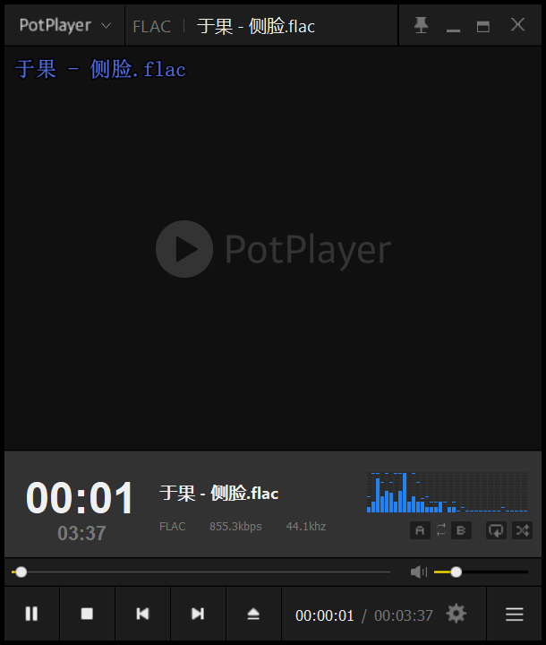

# LyricsAdapter

## 项目介绍：

本项目是一个添加音频元数据的工具。

## 使用：

使用`pip install -r requirements.txt`安装依赖，在终端中执行`python LyricsAdapter.py -h`查看使用方式。

```bash
usage: LyricsAdapter.py [-h] [-d] audiopath

positional arguments:
  audiopath     path of the audio file or directory

optional arguments:
  -h, --help    show this help message and exit
  -d, --delete  delete metadata from the audio file
```

在命令后添加音频文件的路径会自动对音频文件缺失的元数据进行补充，输入文件夹的话会对文件夹下所有的flac和mp3文件进行批量处理，**添加`-d`参数可将输入的文件包含的所有元数据清空**，慎用。

下面举个例子来展示使用流程：



执行以下命令：

```bash
python .\LyricsAdapter.py '.\test\于果 - 侧脸.flac'
```

输出：

```bash

    Args: add
    Audio: .\test\于果 - 侧脸.flac
    Search: 于果  侧脸
    Metadata Status Input:
        artist: True,           # 输入前文件元数据的状态
        title: True,
        lyrics: False,
        cover: False
    Response Status:            # 元数据自动获取的状态
        artist: False,
        title: False,
        lyrics: True,
        cover: True
    Metadata Status Output:     # 输出后文件元数据的状态
        artist: True,
        title: True,
        lyrics: True,
        cover: True

```

此时可以重新打开该音频文件：


文件的封面和歌词已添加完毕。

## 声明：

自动获取元数据使用到了qq音乐的api，这部分基于`https://github.com/MCQTSS/MCQTSS_QQMusic/blob/main/Main.py`项目实现，对应utils目录下的qq_music_api.py文件。

元数据也可手动添加，AudioProcessing()中封面和歌词可以以图片和文本文件的形式输入，暂时未提供使用命令行参数添加。

代码中未利用功能的部分基于`https://github.com/nullptr-0/QmcWasm`项目实现。

本项目仅学习使用。